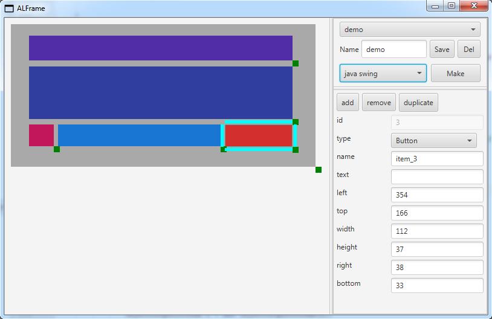
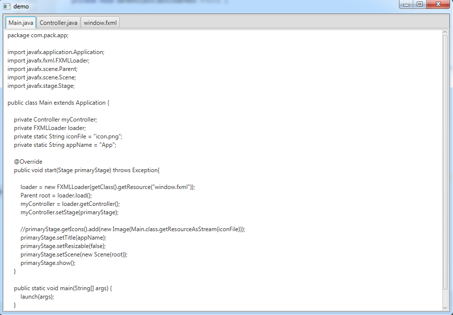
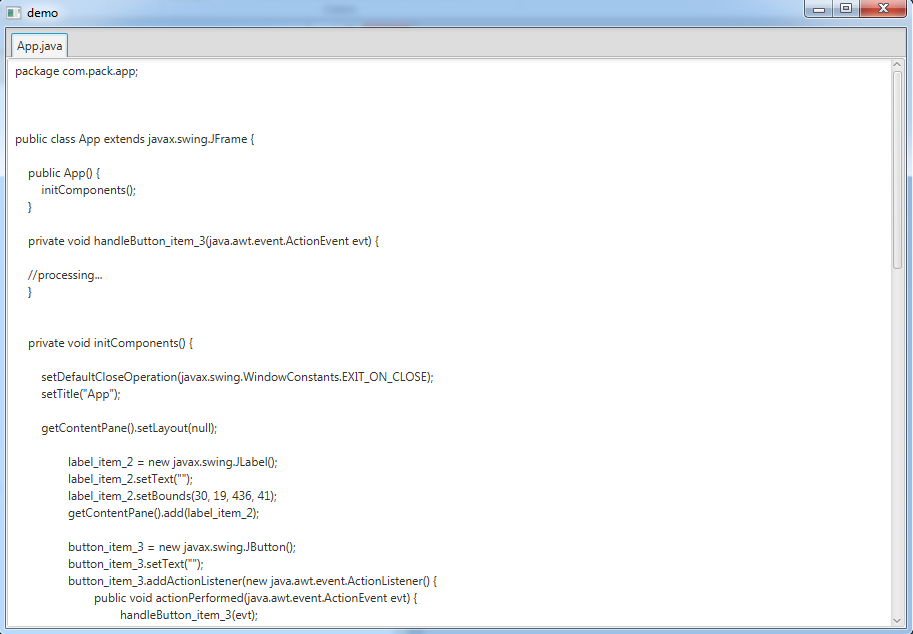

# ALFrame
GUI wireframe designer and multi-language application generator

Design Graphical User Interfaces and export a working application skeleton.
The purpose is to handle automatically :
* boiler plate code to create the matching UI app in a variety of programming languages
* underlying threading code for long-running tasks (UI usually trig actions which can be time consuming)

THIS IS A WORK IN "VERY SLOW" PROGRESS

